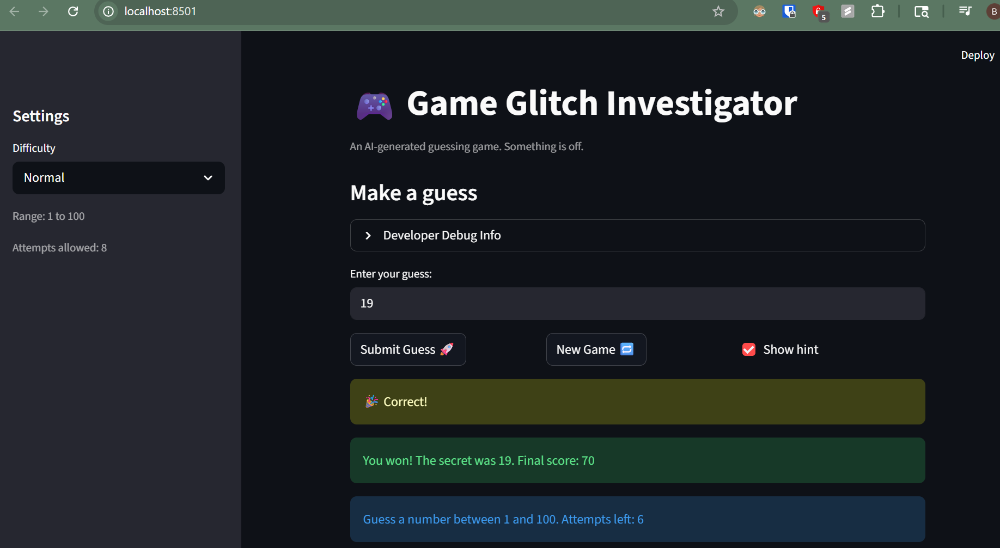
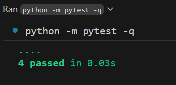

# 🎮 Game Glitch Investigator: The Impossible Guesser

## 🚨 The Situation

You asked an AI to build a simple "Number Guessing Game" using Streamlit.
It wrote the code, ran away, and now the game is unplayable. 

- The hints were backwards.
- The game stops working when new game is clicked after winning the previous game.
- Number of attempts made starts from 1 instead of 0.
## 🛠️ Setup

1. Install dependencies: `pip install -r requirements.txt`
2. Run the broken app: `python -m streamlit run app.py`

## 🕵️‍♂️ Your Mission

1. **Play the game.** Open the "Developer Debug Info" tab in the app to see the secret number. Try to win.
2. **Find the State Bug.** Why does the secret number change every time you click "Submit"? Ask ChatGPT: *"How do I keep a variable from resetting in Streamlit when I click a button?"*
3. **Fix the Logic.** The hints ("Higher/Lower") are wrong. Fix them.
4. **Refactor & Test.** - Move the logic into `logic_utils.py`.
   - Run `pytest` in your terminal.
   - Keep fixing until all tests pass!

## 📝 Document Your Experience

**Game purpose:**
This is a number guessing game built with Streamlit. The player picks a difficulty, gets a limited number of attempts, and tries to guess a randomly chosen secret number. After each guess the game gives a hint telling you to go higher or lower, and awards points based on how quickly you guess correctly.

**Bugs found:**

1. **Backwards hints** — `check_guess` returned "Go HIGHER" when the guess was too high and "Go LOWER" when it was too low, making it impossible to win by following the hints.
2. **Off-by-one on attempts** — `st.session_state.attempts` was initialized to `1` but then incremented again on the first guess, so the counter started at 2 and players lost an attempt before they started.
3. **New Game button frozen** — clicking New Game reset the secret and attempts but never reset `st.session_state.status` back to `"playing"`, so the app hit a `st.stop()` on every rerun and stayed locked on the win/loss screen.
4. **String-conversion glitch** — on every even-numbered attempt the secret was deliberately cast to a string before comparison, breaking both the win condition and hints through broken string comparison logic.

**Fixes applied:**

- Swapped the hint messages in `check_guess` so "Too High" says Go LOWER and "Too Low" says Go HIGHER.
- Changed the attempts initializer from `1` to `0` to match the increment-before-use pattern.
- Added `st.session_state.status = "playing"` and `st.session_state.history = []` to the New Game handler.
- Removed the `attempts % 2 == 0` string-conversion block and the `except TypeError` fallback path entirely.
- Refactored all four game logic functions out of `app.py` into `logic_utils.py` to separate UI from logic.
- Expanded the pytest suite from 3 broken tests to 8 passing tests, including hint-direction verification.

## 📸 Demo

> Add a screenshot of your winning game here — run `streamlit run app.py`, play to a win, then paste the screenshot below.

**pytest results (Challenge 1):**

> Run `pytest tests/ -v` in your terminal and paste a screenshot of the 8 passing tests here.

## 🚀 Stretch Features

- [ ] [If you choose to complete Challenge 4, insert a screenshot of your Enhanced Game UI here]
